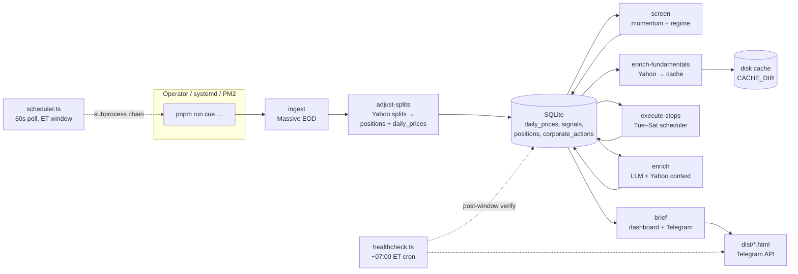

# Cue

A **personal US-equity signal and briefing pipeline** for the **Nasdaq 100** (plus QQQ as regime context). It ingests end-of-day prices, ranks momentum, applies a QQQ regime gate and ATR-style trailing stops, optionally enriches new BUY candidates with an LLM, and delivers a **static HTML dashboard** plus **Telegram** alerts.

**Not an auto-trader** — Cue does not place orders. You review signals and execute trades yourself (for example via a broker app). The system is built as **small, testable TypeScript modules** plus a **SQLite** ledger so you can re-run any stage in isolation.

> **Status:** Core engine, LLM enrichment, dashboard, Telegram, and **unattended scheduler** are in place. EOD data comes from **Massive.com** (Polygon-compatible key in env). Scheduling and all “market day” logic use **`America/New_York`** civil time with locale **`en-US`** (see `src/config/cue-timezone.ts`). Phase 4 **fundamentals** path: Yahoo context is cached on disk; `fundamentals_cache` exists for future persistence.

---

## Why this exists

Retail tools often optimize for either raw charts or a black-box screener. Cue sits in the middle: **repeatable rules** (momentum, regime, stops) plus **optional LLM context** (news, sector, earnings proximity) so you get a short, structured view before the US cash session — without paying for a bundled terminal you do not need.

**What it does on a cadence you control:**

- Pulls **EOD OHLCV** for the configured universe and stores it in SQLite.
- **Screens** for BUY/HOLD/SELL style outcomes, maintains **open positions** and **trailing stop** state.
- On **Sunday rebalance** path (uses **Friday** EOD bars): **split adjustment**, fundamentals prefetch, full screen with `--force-rebalance`, LLM enrich, then brief (BUY alerts + optional **Next in Rank** bench).
- On **Tue–Sat stop** path: price refresh, **split adjustment**, **execute-stops**, then brief (no rebalance-style screen).
- After the **06:00–06:10 ET** pipeline window: optional **`cue healthcheck`** verifies ingest currency, pipeline output, and PM2 error logs, then Telegram ✅/⚠️.
- Builds **`dist/dashboard.html`** and sends **Telegram** messages according to `--mode` (`rebalance` vs `stop`).

Authoritative architecture, locked strategy parameters, and pipeline details: **`.cursor/rules/cue-sou.md`**. Schema: **`.cursor/rules/cue-db-schema.md`**.

---

## Architecture

Stages write to **SQLite** (`better-sqlite3`) so you can debug or backtest without re-hitting vendors.



**Two orchestration paths:**

| Path | Entry | Behaviour |
|------|--------|-----------|
| **Registry pipeline** | `cue run-all`, `cue pipeline --now` | **Sunday** → rebalance chain; **Tue–Sat** → stop chain (`detectRunMode`); **Monday** idle. |
| **Scheduler daemon** | `cue schedule`, `cue pipeline` (no `--now`) | **Sun 06:00–06:10 ET** rebalance; **Tue–Sat 06:00–06:10 ET** stops; **Monday** idle. |
| **Healthcheck** | `cue healthcheck` | Post-window Telegram check; PM2 **`cue-healthcheck`** on Sun/Tue-Sat. |

**LLM:** `src/llm/provider.ts` chooses **Anthropic**, **OpenAI**, **Google AI**, or **Vertex AI** from `LLM_PROVIDER`. The runtime contract is `LLMProvider.complete(messages, maxTokens)`; structured outputs are validated with **Zod** after parsing JSON from the model.

---

## Tech stack

| Layer | Choice |
|-------|--------|
| Runtime | Node.js **22**+, TypeScript **strict**, **ESM** |
| Package manager | **pnpm** 10 (`packageManager` in `package.json`) |
| DB | **SQLite** via `better-sqlite3` (migrations under `src/db/migrations/`) |
| CLI | **commander** (`src/cli.ts`) |
| HTTP | **axios** (Massive, LLM vendor APIs) |
| Validation | **zod** (env, APIs, LLM JSON) |
| Logging | **winston** (`cue-cli`, `pipeline`, `scheduler` services) |
| Tests | **vitest** |

---

## Quickstart

```bash
pnpm install
cp .env.example .env   # fill POLYGON_API_KEY, TELEGRAM_*, LLM keys, etc.

# Create DB parent dir + apply migrations (see package.json shortcuts)
pnpm run db:init       # or: pnpm run db:migrate

pnpm run cue -- doctor    # config + DB probe (no secrets printed)
pnpm test
pnpm run typecheck && pnpm run lint
```

**Verify LLM wiring before a long run:**

```bash
pnpm llm-smoke
# → three steps: plain text, small JSON, mini thesis JSON (timings printed)
```

**One-shot full registry pipeline (subprocess chain):**

```bash
pnpm run-all
# same step set as `cue pipeline --now` / daily-workflow registry
```

**Long-running scheduler (VPS / systemd):**

```bash
pnpm schedule
# 60s polling, fires inside 06:00–06:10 America/New_York on scheduled ET weekdays
```

---

## CLI reference

All commands go through **`pnpm run cue -- <subcommand>`** (or **`pnpm run cue -- --help`**). The repo also defines **pnpm script shortcuts** where helpful.

### Core

| Command | Description |
|---------|-------------|
| `pnpm run cue -- --help` | List subcommands (sorted) |
| `pnpm run cue -- db:migrate` | Apply pending `src/db/migrations/*.sql` (ledger `_migrations`) |
| `pnpm run cue -- doctor` | Diagnostics: config shape, DB file, required env keys (no secret values) |

### Data & screen

| Command | Description |
|---------|-------------|
| `pnpm run cue -- ingest` | Massive grouped daily OHLCV (one REST call) for a session date; universe + QQQ. Options: `--date YYYY-MM-DD` (default: previous ET weekday session, T-1; Mon → Fri), `--ticker SYM`, `--force` refetches that session |
| `pnpm run cue -- adjust-splits` | Yahoo split events → `corporate_actions`; adjusts OPEN `positions` / linked `signals` and retroactive `daily_prices` (OHLC ÷ factor, volume × factor) for `date < ex_date`. Idempotent via `corporate_actions` UNIQUE |
| `pnpm run cue -- backfill-splits` | One-shot: replay existing `corporate_actions` rows against `daily_prices` (idempotent via `pipeline_state`; run once when the ledger has historical splits) |
| `pnpm run cue -- enrich-fundamentals` | Yahoo bundles → disk cache (`--ticker`, `--limit`, `--force`, `--date` reserved) |
| `pnpm run cue -- screen` | Momentum screener / ranking. `--date YYYY-MM-DD` (default: latest QQQ session in DB), `--ticker`, `--force-rebalance` |
| `pnpm run cue -- execute-stops` | Trailing stops / max-hold for OPEN positions (stop-day path). `--date YYYY-MM-DD` (default: latest QQQ session); `--dry-run` reserved |

### LLM & brief

| Command | Description |
|---------|-------------|
| `pnpm run cue -- enrich` | LLM enrichment for pending **BUY** and **WATCHLIST** signals (`thesis-generator`) |
| `pnpm run cue -- llm-smoke` | Live smoke: text + JSON + mini thesis (`pnpm llm-smoke`) |
| `pnpm run cue -- brief` | Dashboard HTML + Telegram. Rebalance: BUY alerts + **Next in Rank** bench (`WATCHLIST_BENCH_DEPTH`, default 5). Dashboard: **Live Performance** (strategy exits only; excludes `MANUAL` / `REBALANCE_DROP`) and **backtest ref** from latest **`MOMENTUM` + `locked = 1`** run (`window_label` in UI). Options: `--mode rebalance\|stop`, `--skip-dashboard`, `--skip-alert`, `--open` |
| `pnpm run cue -- brief:dashboard` | Write `dist/dashboard.html` only (`pnpm dashboard`, `pnpm dashboard:open`) |
| `pnpm run cue -- brief:alert` | Telegram only (internal; expects `--mode` in argv) |

### Orchestration

| Command | Description |
|---------|-------------|
| `pnpm run cue -- run-all` | One-shot **registry** pipeline via subprocesses (`pnpm run-all`) |
| `pnpm run cue -- pipeline --now` | Same as `run-all` (explicit one-shot) |
| `pnpm run cue -- pipeline` | **No `--now`:** same daemon as **`pnpm run cue -- schedule`** |
| `pnpm run cue -- schedule` | Scheduler daemon (`pnpm schedule`) |
| `pnpm run cue -- healthcheck` | Post-pipeline checks (`daily_prices`, signals/stops, PM2 log) + Telegram alert |

### Other scripts (`package.json`)

| Script | Maps to |
|--------|---------|
| `pnpm cue` | `tsx src/cli.ts` (pass args after the script name, e.g. `pnpm run cue ingest --date …` or `pnpm run cue -- ingest --date …`) |
| `pnpm db:init` | `tsx src/db/schema.ts` (init + migrate from config) |
| `pnpm db:migrate` | `pnpm run cue -- db:migrate` |
| `pnpm backtest` | `tsx src/backtest/runner.ts` (default momentum). Research: `pnpm run backtest -- --strategy quality-garp` (defaults `2023-01-01`→`2025-12-31`), `pnpm run backtest -- --strategy vix-momentum` (P7-G sweep; defaults `2022-01-01`→`2025-12-31`). Override window with `--from` / `--to` |
| `pnpm ingest` / `pnpm fetch` | `pnpm run cue -- ingest` |
| `pnpm screen` | `pnpm run cue -- screen` |
| `pnpm enrich` | `pnpm run cue -- enrich` |
| `pnpm brief` | `pnpm run cue -- brief` |
| `pnpm pipeline` / `pnpm pipeline:now` | `pnpm run cue -- pipeline` / `pnpm run cue -- pipeline --now` |
| `pnpm rebuild:native` | `pnpm rebuild better-sqlite3` |

---

## Configuration

1. **`.env`** — validated at startup by `src/config/index.ts` (`zod`). See **`.env.example`** for variables.
2. **`DB_PATH`** — default `./db/cue.db`.
3. **`LOCK_PATH`** — cross-process scheduler PID lockfile (default `./db/cue.lock`; cleared when holder PID is dead).
4. **`CACHE_DIR`** — Yahoo / ingest caches (default `./data/cache`).
5. **`LLM_PROVIDER`** — `anthropic` \| `openai` \| `google` \| `vertex` (provider-specific keys required; Vertex needs `VERTEX_PROJECT_ID` + ADC or service account per `google-auth-library` usage in code).

Strategy thresholds (`MAX_POSITIONS`, `WATCHLIST_BENCH_DEPTH`, `STOP_LOSS_PCT`, RSI gates, etc.) are loaded with the same env object; see **`.cursor/rules/cue-sou.md`** for **locked** momentum / ATR / regime rules. Set **`WATCHLIST_BENCH_DEPTH=0`** to disable watchlist rows and the rebalance **Next in Rank** Telegram message.

---

## Timezone

All **calendar day** and **scheduler window** logic for the US equity pipeline uses:

- **`CUE_TIME_ZONE`** = `America/New_York`
- **`CUE_LOCALE`** = `en-US`

Defined in **`src/config/cue-timezone.ts`** and used from ingest date helpers, `daily-workflow.ts`, and CLI copy where relevant.

---

## Deployment notes

- **PM2:** `deploy/ecosystem.config.cjs` defines:
  - **`cue`** — long-lived scheduler (`src/cli.ts pipeline` or **`src/cli.ts schedule`**); logs `logs/pm2-cue.log`.
  - **`cue-healthcheck`** — post-window check (`0 11 * * 0,2,3,4,5,6` UTC ≈ ~07:00 ET on Sun/Tue-Sat). Use **`0 7 * * 0,2,3,4,5,6`** if host clock is **America/New_York** (PM2 7+ rejects `0,2-6` in cron).
- **systemd:** run `cue schedule` (or `cue pipeline`) as a `Type=simple` long-lived service; send `SIGTERM` for clean shutdown (scheduler closes its readonly DB handle). Schedule `cue healthcheck` separately (cron or second unit) if not using PM2 for the healthcheck app.

---

## Repo layout (high level)

```
cue/
  data/
    universe/       `nasdaq100.json` (constituents) + `_meta.json` (as-of, counts, QQQ note)
  src/
    agents/           thesis-generator, daily-workflow (registry), scheduler.ts, healthcheck.ts
    analysers/        momentum-screener (screen, execute-stops CLI)
    briefing/         dashboard HTML, Telegram dispatcher
    cli/              doctor, llm-smoke, shared CLI helpers (`ymd-arg.ts`)
    config/           env (zod), cue-timezone.ts
    db/               migrations/, queries.ts, provider.ts, schema.ts
    enrichers/        momentum types / math used by screener
    ingestors/        Massive price ingest, corporate-actions (splits), enrich-fundamentals CLI
    universe/         shared `load-universe.ts` (tickers + `_meta.json`)
    llm/              provider adapters, enricher, prompt, yahooContext
    backtest/         historical runner (separate tsx entry)
  deploy/             PM2 ecosystem example
  tests/              vitest
```

---

## Development

```bash
pnpm test              # vitest run
pnpm test:watch
pnpm run typecheck     # tsc --noEmit
pnpm run lint          # eslint
```

Conventions: strict TypeScript, ESM **`import`/`export`**, no ORM (prepared SQL in `queries.ts`), env only through **`getConfig()`**.

---

## Troubleshooting: native SQLite build

If **`better-sqlite3`** fails to compile (e.g. **`'climits' file not found`** on macOS), see the detailed **SDK / `CXX` single-path** instructions in the previous README section — the fix is **`pnpm install --ignore-scripts`**, set **`SDKROOT`** + **`CXXFLAGS`**, then **`pnpm run rebuild:native`**.

---

## Disclaimer

> This software is for **personal research and education** only. It is **not** investment advice. The authors are not responsible for trading losses. US market data may lag vendor publication; always verify prices and filings with your broker and official sources.

---

*License: not specified in this repository; confirm with the maintainer.*
